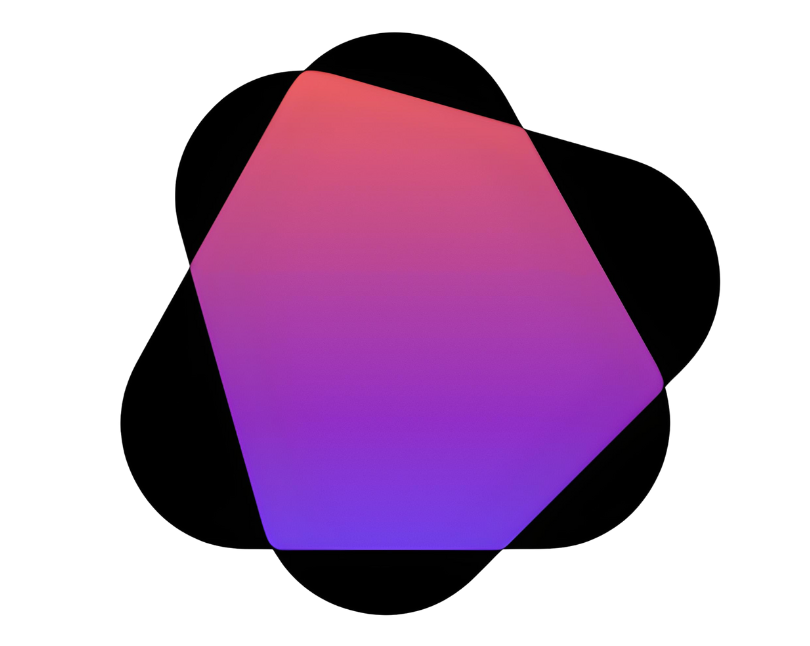

<p align="center">
  
</p>

# rowana: tell ai what's what.

<p align="center">
  <i>ai is the new front door. is yours locked?</i>
</p>

Welcome to the Rowana project! This repository contains the source code for the Rowana website and potentially related tooling.

## Description

Without the right signals, LLMs might ignore your site or misrepresent your product. Don't let a confused AI bury your brand or become your unintended spokesperson.

Rowana is the build-time NPM tool that adds the structured data (like Schema.org) AI desperately needs to understand your product. No more hoping LLMs get it right—**make them get it right.**

This repository contains the landing page/website for Rowana. The core tool can be found at [rowana-ai/rowana-core](https://github.com/rowana-ai/rowana-core).

## Key Features (of the core tool)

*   **Accuracy:** Force AI to represent your product correctly.
*   **Control:** You built it, you define it. Take back control.
*   **Less Headache:** Set it up once, integrate it into your build, and forget about it.

## Getting Started (This Website)

### Prerequisites

- Node.js (e.g., v18 or higher)
- pnpm (e.g., v8 or higher)

### Installation (This Website)

1. Clone this repository:
   ```bash
   git clone https://github.com/rowana-ai/rowana-landing.git # Assuming this is the repo name
   cd rowana-landing
   ```
2. Install dependencies:
   ```bash
   pnpm install
   ```

### Running the Development Server

To start the development server, run:

```bash
pnpm dev
```

Open [http://localhost:3000](http://localhost:3000) with your browser to see the result.

## Building the Website for Production

To build the website for production, run:

```bash
pnpm build
```

## Technologies Used

- Next.js
- React
- TypeScript
- Tailwind CSS
- Shadcn UI

## How Rowana Works (The Core Tool)

The following instructions are for using the core Rowana NPM package, which can be found at [rowana-ai/rowana-core](https://github.com/rowana-ai/rowana-core).

1.  **Install the package:** `npm install @rowana/core` (or `pnpm add @rowana/core`)
2.  **Set up your config:** Create a `rowana.config.js` (or similar) to define your organization, product details, etc. See the [core repository](https://github.com/rowana-ai/rowana-core) for configuration details.
3.  **Hook into your build:** Add `rowana generate` to your build script (e.g., `"build": "rowana generate && next build"`).

Rowana reads your config and generates the necessary structured data, injecting it into your site during the build process.

## Contributing

Contributions are welcome! Please refer to the [CONTRIBUTING.md](CONTRIBUTING.md) file (if it exists) or open an issue to discuss potential changes.

## License

This project is licensed under the MIT License. See the [LICENSE](LICENSE) file for details (if it exists).
